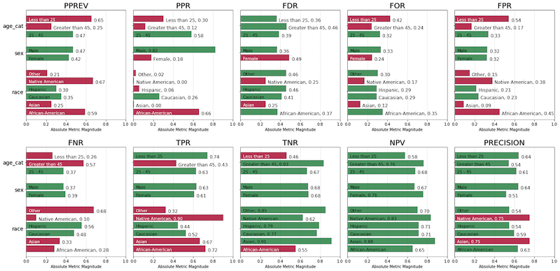
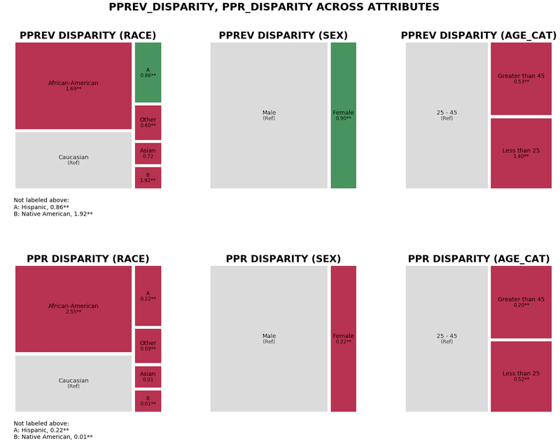

# The Bias and Fairness Audit Toolkit

Aequitas is an open-source bias audit toolkit for data scientists, machine learning researchers, and policymakers to audit machine learning models for discrimination and bias, and to make informed and equitable decisions around developing and deploying predictive tools.


[Visit the Aequitas project website](http://dsapp.uchicago.edu/aequitas/) 

[Try out the Aequitas web application](http://aequitas.dssg.io/) 


## Documentation

You can find the toolkit documentation [here](https://dssg.github.io/aequitas/)

For usage examples of the python library, see our [demo notebook](https://github.com/dssg/aequitas/blob/master/docs/source/examples/compas_demo.ipynb) using Aequitas on the ProPublica COMPAS Recidivism Risk Assessment dataset.


## Installation


Aequitas is compatible with: **Python 3.6+**

Install Aequitas using pip:

    pip install aequitas


Install master from source:

    python setup.py install

...or named as an installation requirement, *e.g.* via ``pip``:

    python -m pip install git+https://github.com/dssg/aequitas.git


You may then import the ``aequitas`` module from Python:

    import aequitas

...or execute the auditor from the command line:

    aequitas-report

...or launch the Web front-end from the command line (localhost):

    python -m serve


### Containerization

To build a Docker container of Aequitas:

    docker build -t aequitas .

...or simply via ``manage``:

    manage container build

The Docker image's container defaults to launching the development Web server, though this can be overridden via the Docker "command" and/or "entrypoint".

To run such a container, supporting the Web server, on-the-fly:

    docker run -p 5000:5000 -e "HOST=0.0.0.0" aequitas

...or, manage a development container via ``manage``:

    manage container [create|start|stop]

To contact the team, please email us at [aequitas at uchicago dot edu]


## 30 Seconds to Aequitas


**CLI**

With ``aequitas-report``, uncovering bias is as simple as running a single command on a CSV::

    aequitas-report --input compas_for_aequitas.csv


**Python API**

To get started, preprocess your input data. Input data has slightly different requirements depending on whether you are using Aequitas via the webapp, CLI or Python package. See `general input requirements <#input-data>`_ and specific requirements for the `web app <#input-data-for-webapp>`_, `CLI <#input-data-for-cli>`_, and `Python API <#input-data-for-python-api>`_ in the section immediately below. 
``` python
    from Aequitas.preprocessing import preprocess_input_df()
    
    df['categorical_column_name'] = df['categorical_column_name'].astype(str)
    df, _ = preprocess_input_df(*input_data*)
``` 
The Aequitas ``Group()`` class creates a crosstab of your preprocessed data, calculating absolute group metrics from score and label value truth status (true/ false positives and true/ false negatives)

``` python
    from aequitas.group import Group
    g = Group()
    xtab, _ = g.get_crosstabs(df)
``` 
The ``Plot()`` class can visualize a single group metric with ``plot_group_metric()``, or a list of bias metrics with ``plot_group_metric_all()``:
``` python
    p = Plot()
    selected_metrics = p.plot_group_metric_all(xtab, 
                metrics=['ppr','pprev','fnr','fpr'], 
                ncols=4)
``` 


The crosstab dataframe is augmented by every succeeding class with additional layers of information about biases, starting with bias disparities in the ``Bias()`` class. There are three ``get_disparity`` functions, one for each of the three ways to select a reference group. ``get_disparity_min_metric()`` and ``get_disparity_major_group()`` methods calculate a reference group automatically based on your data, while the user specifies reference groups for ``get_disparity_predefined_groups()``.
``` python
    b = Bias()
    bdf = b.get_disparity_predefined_groups(xtab, 
                        original_df=df, 
                        ref_groups_dict={'race':'Caucasian', 'sex':'Male', 'age_cat':'25 - 45'}, 
                        alpha=0.05, 
                        mask_significance=True)
``` 
[Learn more about reference group selection.](https://dssg.github.io/aequitas/config.html)


The ``Plot()`` class visualizes disparities as treemaps colored by disparity relationship to a given [fairness threshold]( https://dssg.github.io/aequitas/config.html) with ``plot_disparity()`` or multiple with ``plot_disparity_all()``:
``` python
    j = aqp.plot_disparity_all(bdf, 
                metrics=['ppr_disparity', 'pprev_disparity', 'fnr_disparity', 
                    'fpr_disparity', 'precision_disparity', 'fdr_disparity'], 
                attributes=['race'], significance_alpha=0.05)
``` 


Now you're ready to obtain metric parities with the ``Fairness()`` class:
``` python
    f = Fairness()
    fdf = f.get_group_value_fairness(bdf)
``` 
You now have parity determinations for your models that can be leveraged in model selection!

To visualize fairness, use ``Plot()`` class fairness methods.

To visualize ``'all'`` group absolute bias metric parity determinations:
``` python
    fg = aqp.plot_fairness_group_all(fdf, ncols=5, metrics = "all")
    wheat
``` 




To visualize parity treemaps for multiple disparities, pass metrics of interest as a list:
``` python
    f_maps = aqp.plot_fairness_disparity_all(fdf, metrics=['pprev_disparity', 'ppr_disparity'])
``` 




### Input Data

In general, input data is a single table with the following columns:

- ``score``
- ``label_value`` (for error-based metrics only)
- at least one attribute e.g. ``race``, ``sex`` and ``age_cat`` (attribute categories defined by user)

=====  ===========  ================  ==== === ======
score  label_value  race              sex  age income
=====  ===========  ================  ==== === ======
0      1            African-American  Male 25  18000
1      1            Caucasian         Male 37  34000
=====  ===========  ================  ==== === ======

[Back to 30 Seconds to Aequitas](#30-seconds-to-aequitas)

#### Input data for Webapp


The webapp requires a single CSV with columns for a binary ``score``, a binary ``label_value`` and an arbitrary number of attribute columns. Each row is associated with a single observation.


##### `score``

Aequitas webapp assumes the ``score`` column is a binary decision (0 or 1).


##### ```label_value``

This is the ground truth value of a binary decision. The data again must be binary 0 or 1.


##### `attributes (e.g. ``race``, ``sex``, ``age``, ``income``)

Group columns can be categorical or continuous. If categorical, Aequitas will produce crosstabs with bias metrics for each group_level. If continuous, Aequitas will first bin the data into quartiles and then create crosstabs with the newly defined categories.

[Back to 30 Seconds to Aequitas](#30-seconds-to-aequitas)


####  Input data for CLI


The CLI accepts CSV files and accommodates database calls defined in Configuration files.


##### ``score``

By default, Aequitas CLI assumes the ``score`` column is a binary decision (0 or 1). Alternatively, the ``score`` column can contain the score (e.g. the output from a logistic regression applied to the data). In this case, the user sets a threshold to determine the binary decision. `See configurations <https://dssg.github.io/aequitas/config.html>`_ for more on thresholds.


##### ``label_value``

As with the webapp, this is the ground truth value of a binary decision. The data must be binary 0 or 1.


##### attributes (e.g. ``race``, ``sex``, ``age``, ``income``)

Group columns can be categorical or continuous. If categorical, Aequitas will produce crosstabs with bias metrics for each group value. If continuous, Aequitas will first bin the data into quartiles.

##### ``model_id``

``model_id`` is an identifier tied to the output of a specific model. With a ``model_id`` column you can test the bias of multiple models at once. This feature is available using the CLI or the Python package.


##### Reserved column names:


* ``id``
* ``model_id``
* ``entity_id``
* ``rank_abs``
* ``rank_pct``


`Back to 30 Seconds to Aequitas <#30-seconds-to-aequitas>`_


#### Input data for Python API

Python input data can be handled identically to CLI by using ``preprocess_input_df()``. Otherwise, you must discretize continuous attribute columns prior to passing the data to ``Group().get_crosstabs()``.

``` python
    from Aequitas.preprocessing import preprocess_input_df()
    # *input_data* matches CLI input data norms.
    df, _ = preprocess_input_df(*input_data*)
``` 


##### ``score``

By default, Aequitas assumes the ``score`` column is a binary decision (0 or 1). If the ``score`` column contains a non-binary score (e.g. the output from a logistic regression applied to the data), the user sets a threshold to determine the binary decision. Thresholds are set in a dictionary passed to `get_crosstabs()` of format {'rank_abs':[300] , 'rank_pct':[1.0, 5.0, 10.0]}. [See configurations](https://dssg.github.io/aequitas/config.html) for more on thresholds.

##### ``label_value``

This is the ground truth value of a binary decision. The data must be binary (0 or 1).


##### attributes (e.g. ``race``, ``sex``, ``age``, ``income``)

Group columns can be categorical or continuous. If categorical, Aequitas will produce crosstabs with bias metrics for each group_level. If continuous, Aequitas will first bin the data into quartiles.

If you plan to bin or discretize continuous features manually, note that ``get_crosstabs()`` expects attribute columns to be of type 'string'. This excludes the ``pandas`` 'categorical' data type, which is the default output of certain ``pandas`` discretizing functions. You can recast 'categorical' columns to strings:

```python 
   df['categorical_column_name'] = df['categorical_column_name'].astype(str)
``` 

##### ``model_id``

``model_id`` is an identifier tied to the output of a specific model. With a ``model_id`` column you can test the bias of multiple models at once. This feature is available using the CLI or the Python package.


##### Reserved column names:

* ``id``
* ``model_id``
* ``entity_id``
* ``rank_abs``
* ``rank_pct``


[Back to 30 Seconds to Aequitas](#30-seconds-to-aequitas)


### Development


Provision your development environment via the shell script ``develop``:

    ./develop

Common development tasks, such as deploying the webapp, may then be handled via ``manage``:

    manage --help


## Citing Aequitas


If you use Aequitas in a scientific publication, we would appreciate citations to the following paper:

Pedro Saleiro, Benedict Kuester, Abby Stevens, Ari Anisfeld, Loren Hinkson, Jesse London, Rayid Ghani, Aequitas: A Bias and Fairness Audit Toolkit,  arXiv preprint arXiv:1811.05577 (2018). ([PDF](https://arxiv.org/pdf/1811.05577.pdf))

```bib
   @article{2018aequitas,
     title={Aequitas: A Bias and Fairness Audit Toolkit},
     author={Saleiro, Pedro and Kuester, Benedict and Stevens, Abby and Anisfeld, Ari and Hinkson, Loren and London, Jesse and Ghani, Rayid}, journal={arXiv preprint arXiv:1811.05577}, year={2018}}
``` 
